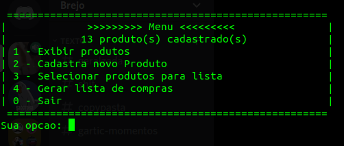
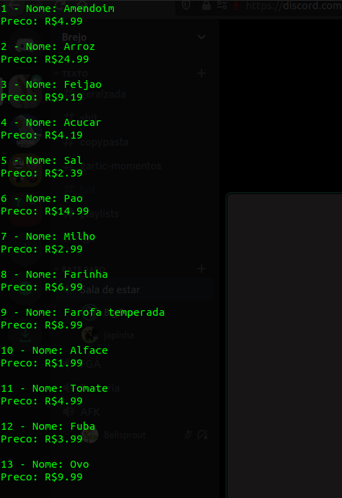
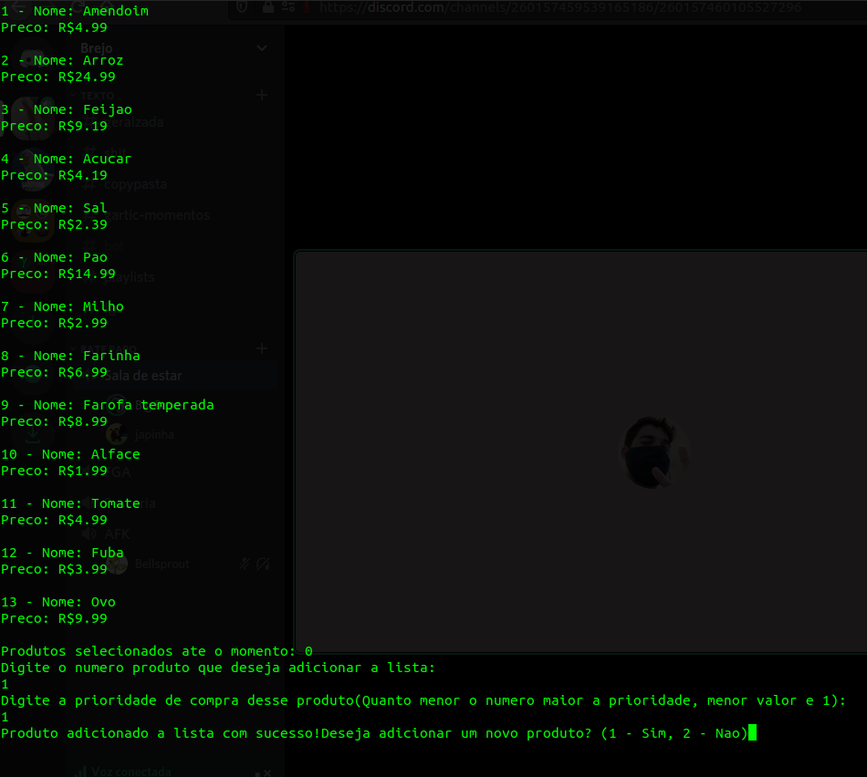

# Organizador de semestres

**Número da Lista**: 4 
**Conteúdo da Disciplina**: Dividir e Conquistar 

## Alunos
|Matrícula | Aluno |
| -- | -- |
| 17/0103200  |  Gabriel Alves Hussein |
| 17/0164411  |  Victor Amaral Cerqueira |

## Sobre 
Um supermercado deseja criar um aplicativo que gera uma lista de compras a partir da prioridade dos produtos selecionados e o orçamento do cliente.

## Screenshots

## Instalação 
**Linguagem**: C 

## Uso 
Compilar o arquivo main.c com o comando "gcc -o main.c"
